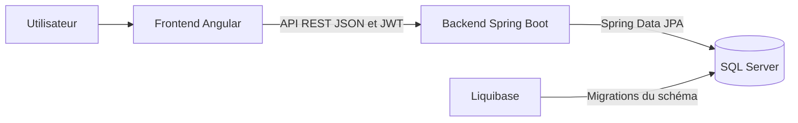

# Dossier d'architecture

## 1. Présentation du projet

L'application est une plateforme de gestion de matchs de padel.

Elle permet aux joueurs de consulter les matchs disponibles, de créer un match, de rejoindre un match et de suivre leurs participations et paiements. Elle propose aussi un espace d'administration pour gérer les inscriptions, horaires, fermetures, statistiques et historiques.

Le projet est composé de trois parties :

- un frontend Angular ;
- un backend Spring Boot ;
- une base SQL Server.

## 2. Architecture globale

Structure principale du dépôt :

```text
PDW-SGBD-padel-examen/
├── backend/
│   └── backend/
│       ├── pom.xml
│       ├── docker-compose.yml
│       ├── .env.example
│       └── src/
└── frontend/
```

Le frontend Angular affiche les pages et appelle l'API REST. Le backend Spring Boot reçoit les requêtes, applique les règles métier et communique avec SQL Server. Liquibase gère les migrations du schéma de base de données.



## 3. Architecture backend

Le backend est une application Spring Boot en Java 21 située dans `backend/backend/`.

Il suit une structure classique :

- `Controller` : expose les endpoints REST ;
- `Service` : contient les règles métier ;
- `Repository` : accède à la base avec Spring Data JPA ;
- `DTO` : objets échangés avec le frontend ;
- entités : objets persistés en base de données.

Les services portent les règles importantes : création de match, inscription, paiement, annulation, pénalités et droits administrateur.

Le backend gère aussi les erreurs API de façon centralisée pour éviter de renvoyer des réponses techniques brutes au frontend.

## 4. Architecture frontend

Le frontend est une application Angular standalone.

Organisation principale :

- `core` : authentification, guards, interceptors et services API ;
- `features` : pages fonctionnelles ;
- `shared` : composants et outils réutilisables ;
- `layout` : navigation et structure générale.

Les services Angular appellent l'API backend. Le guard protège les pages privées. L'interceptor ajoute le JWT aux requêtes quand l'utilisateur est connecté.

L'interface utilise Angular Material et TailwindCSS. Elle est prévue pour mobile, tablette et ordinateur.

## 5. Sécurité

L'authentification utilise JWT.

Après connexion, le frontend stocke le token et l'envoie aux endpoints protégés. Le backend vérifie ensuite les droits avant d'exécuter l'action demandée.

Rôles principaux :

- joueur ;
- administrateur de site ;
- administrateur global.

La connexion et l'inscription sont accessibles sans être connecté. La consultation des sites est aussi publique dans la configuration actuelle. Les autres accès dépendent des règles de sécurité backend.

La visibilité `PUBLIC` d'un match est indépendante de la sécurité de l'API.

Les boutons masqués côté Angular ne remplacent jamais les contrôles du backend.

## 6. Base de données

Les données sont stockées dans SQL Server.

Le backend utilise Spring Data JPA pour lire et écrire les données.

Liquibase versionne le schéma de la base avec des changelogs. Cela permet de recréer la structure attendue sur un autre environnement.

En mode Docker, `db-init.sh` prépare la base et les accès SQL nécessaires.

Les tables métier restent créées et mises à jour par Liquibase.

Le seed de démonstration est utilisé en développement/local. Il fournit les données utiles pour la démonstration et les tests Cypress.

## 7. Swagger

Swagger permet de consulter et tester l'API.

Avec le backend Docker lancé sur `8080` :

```text
http://localhost:8080/swagger-ui/index.html
```

L'accès dépend de la configuration `SWAGGER_PERMIT_ALL`.

## 8. Tests

Le projet contient plusieurs niveaux de tests :

- tests backend pour les services, règles métier et endpoints ;
- tests Angular pour les services, composants et pages importantes ;
- tests Cypress pour des parcours réels dans le navigateur.

Résultats validés avant remise :

```text
539 tests backend réussis
Package backend réussi
91 tests Angular réussis
Build Angular réussi
6 tests Cypress E2E réussis
```

## 9. Limites

L'arborescence `backend/backend/` est conservée pour stabiliser la remise. Sa simplification a été étudiée mais reportée.

Les tests Cypress couvrent des parcours non destructifs. Ils ne créent pas et n'annulent pas réellement des matchs.

Les matchs seedés dépendent de la date d'initialisation de la base. Une base récente est préférable pour la démonstration.

## 10. Conclusion

Le projet repose sur une séparation claire entre :

- Angular pour l'interface utilisateur ;
- Spring Boot pour l'API et les règles métier ;
- SQL Server pour les données ;
- Liquibase pour les migrations.

Cette architecture permet une séparation simple entre frontend, backend et base de données.
